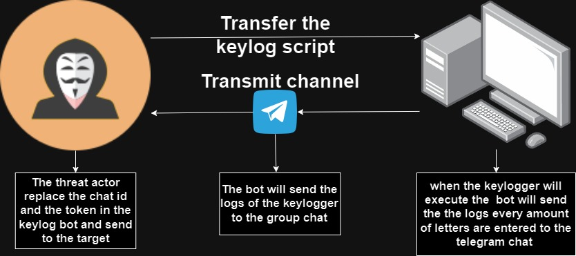
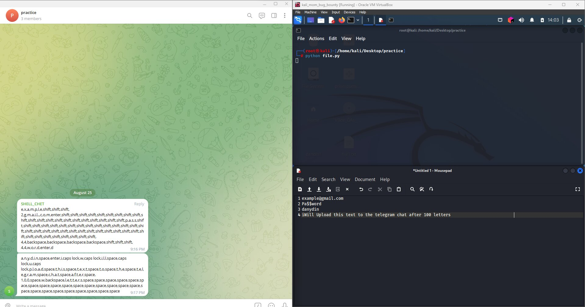

<h1 align="center">PY_Telegram_keylogger</h1>
The Telegram Keylogger Bot is a Python script that leverages the Telegram Bot API to establish a covert communication channel with remote agents (Telegram bots acting as agents). This tool allows you to upload the keylogger logs throw the WAN without using any other configuration and using a reliable platform and legitmate API calls.

<h4>Demonstration Diagram:</h4>



<h4>Demonstration Image:</h4>




<h2 align="center">Features</h2>

- Covertly logs key presses on the target system.
- Communicates with remote agents (Telegram bots) using the Telegram Bot API.
- Uses the Telegram chat as the upload chat, bypassing the need for Telegram installation on the target system.
- Provides error handling for smooth operation.

<h2 align="center">Usage</h2>

- Install the required packages:

   ```bash
   pip install -r requirements.txt
   # OR
   pip install keyboard telepot urllib3==1.24.1
   ```

- Set up a Telegram bot and obtain the API token and get the chat id of the group chat.

- Replace the TOKEN and CHAT_ID values in the script with your own bot's API token and desired chat ID.

- Run the script:

  ```
  python keyboard_bot.py
  ```
  
- The keylogger will capture key presses and send them to the specified Telegram chat.

<h2 align="center">Disclaimer</h2>
This script is intended for educational and ethical purposes only. The developer assumes no responsibility for any unauthorized or malicious use of this tool.

<h2 align="center">License</h2>

This project is licensed under the MIT License - see the [LICENSE](LICENSE) file for details.

<h2 align="center">Author</h2>

- [D0rDa4aN919](https://github.com/D0rDa4aN919)

<h2 align="center">Acknowledgments</h2>
The tool was developed to demonstrate how to produce and disseminate C2C telegram in a controlled setting. It is not meant to support or facilitate any nefarious or unlawful activity..

